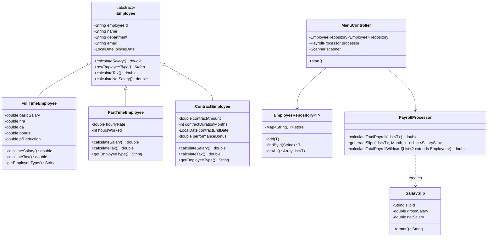

# Employee Payroll Management System (Java)

## Overview
A console-based Employee Payroll Management System built in Core Java (JDK 17). It manages Full-Time, Part-Time, and Contract employees, calculates dynamic salaries by employee type, generates format-adaptive salary slips, and maintains employee records in-memory.

This project extensively uses core Object-Oriented Programming (OOP) concepts, Generics, Collections, and Exception Handling, fulfilling strict academic requirements without relying on external libraries or frameworks.

## Project Architecture
The project follows a clean N-Tier Layered Architecture to enforce separation of concerns:
1. **Model Layer (`payroll.model`)**: Contains the core business entities (`Employee` hierarchy and `SalarySlip`).
2. **Repository Layer (`payroll.repository`)**: Simulates a database using generic, in-memory collections (`HashMap`) to manage data access and persistence.
3. **Service Layer (`payroll.service`)**: Encapsulates the business logic (`PayrollProcessor`, `SalarySlipGenerator`), keeping it isolated from UI and data storage.
4. **Utility Layer (`payroll.util`)**: Provides reusable, generic methods for data processing and safe user input validation.
5. **UI Layer (`payroll.ui`)**: Handles interactive console menus (`MenuController`), ensuring the presentation logic is distinct from the core application logic.
6. **Exception Layer (`payroll.exception`)**: Centralizes custom, meaningful error handling for predictable application flow.

## Features
- **Add Employee:** Create Full-Time, Part-Time, or Contract employees.
- **View & Search:** Display all employees or search by unique Employee ID.
- **Update & Delete:** Modify basic employee details or remove an employee from the system.
- **Calculate Salary:** Dynamically calculate gross, tax, and net salaries based on employee type.
- **Generate Salary Slip:** Display a beautifully formatted console slip, adapting to earnings specifically relevant to the employee type, with an option to save to a `.txt` file.
- **Run Global Payroll:** Calculates and reports the total company payroll and dynamically prints slips for everyone.
- **Reporting:** View employees grouped by department, filter by type, and find the highest-paid employee.
- **Robust Validation:** Safely handles all inputs, preventing crashes on invalid input like characters instead of integers.

## How to Compile and Run

Open your terminal or command prompt and follow these instructions from the root of the project:

### 1. Compile the code
```bash
# Create an output directory
mkdir out

# Compile all source files into the out directory
javac -d out src/payroll/**/*.java src/payroll/*.java

# For Windows CMD specifically:
dir /s /b src\*.java > sources.txt
javac -d out @sources.txt
```

### 2. Run the Main Application
```bash
java -cp out payroll.Main
```

### 3. Run the Automated Tests
```bash
java -cp out payroll.TestRunner
```

## Concept Mapping

| Concept | File/Class Name | Description / Line location |
|---|---|---|
| **Abstract classes** | `model/Employee.java` | Base `Employee` class is declared `abstract` with abstract methods. |
| **Inheritance** | `model/FullTimeEmployee.java` | Subclasses `extend Employee` inheriting fields and methods. |
| **Polymorphism** | `ui/MenuController.java` | The `runPayroll()` method loops over `List<Employee>` calling `calculateSalary()` dynamically at runtime. |
| **Method overriding** | `model/PartTimeEmployee.java` | Overrides `calculateSalary()`, `calculateTax()`, and `getEmployeeType()`. |
| **Generics** | `repository/EmployeeRepository.java` | The repository class is strongly typed with generics. |
| **Bounded types** | `util/GenericUtils.java` | `max()` and `filter()` use `<T extends Employee>`. |
| **Wildcards** | `service/PayrollProcessor.java` | `calculateTotalPayrollWildcard(List<? extends Employee>)` demonstrates bounded wildcards. |
| **ArrayList** | `repository/EmployeeRepository.java` | Uses `ArrayList` to return all map values in `getAll()`. |
| **HashMap** | `repository/EmployeeRepository.java` | Uses `HashMap<String, T>` for quick O(1) employee ID lookups. |
| **Exception handling** | `ui/MenuController.java` | Implements robust `try/catch` and custom checked/unchecked exceptions during flow control. |
| **Try-with-resources**| `service/SalarySlipGenerator.java`| Automates closing the `BufferedWriter` for saving slips. |

## UML Class Diagram


